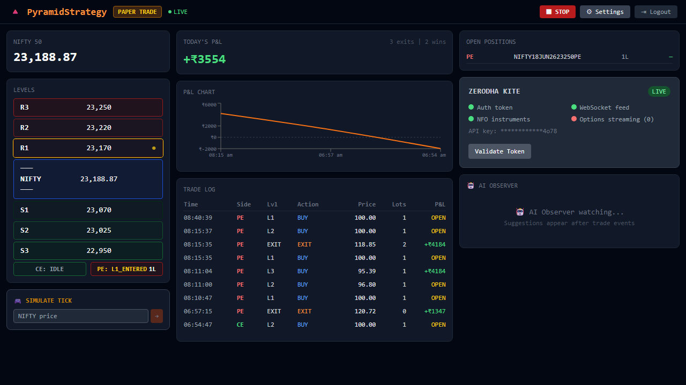
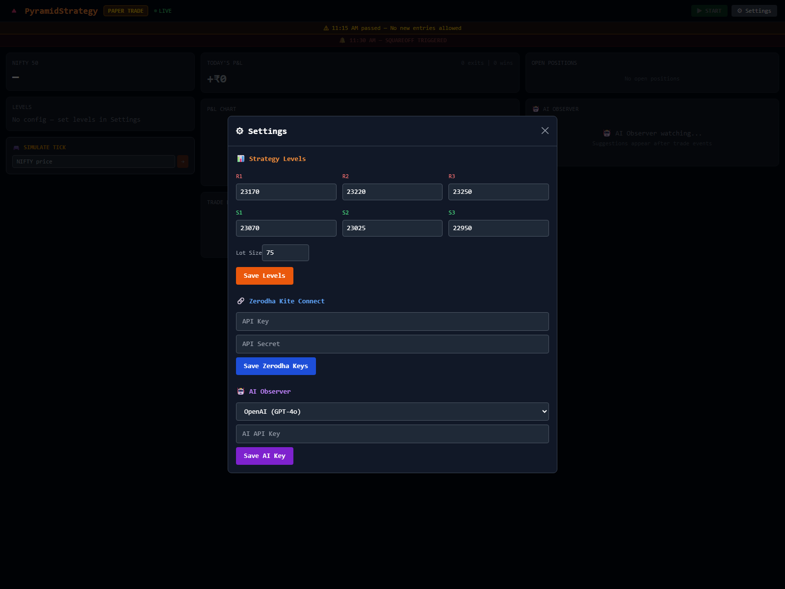

# PyramidStrategy 📈

Automated NIFTY options trading system implementing the intraday multi-level pyramid averaging strategy. Designed with real-time state tracking, interactive web dashboard, automated Kite brokerage API integration, and dynamic multi-channel reporting.

## 🌟 Key Features

- **Multi-Level Averaging Strategy (L1 ➔ L2 ➔ L3)**: Intraday CE and PE legs are managed independently. Strike prices are locked at first entry, and positions are averaged down at custom configured price intervals.
- **Dynamic Risk Management (Target & SL)**:
  - **Dynamic Targets**: Calculated off the cumulative position average entry price (e.g., `+20 points`).
  - **Dynamic Stop Loss**: Automatically activated at Level 3 entries (calculated as L3 entry price `-10 points`) to protect capital.
- **Automated Kite Login & Token Management**: Auto-handles Zerodha Kite Connect logins and session token storage.
- **Instant Telegram & WhatsApp Notifications**:
  - **Engine Starts**: Alerts dispatched immediately when the trading engine is launched from the UI.
  - **Daily EOD PDF Reports**: Automatically compiles a professional PDF digest containing performance charts, executive trade logs, and rule-trigger audits, sent to Telegram/WhatsApp daily.
- **Real-Time Web Dashboard**: Clean modern UI with live states, P&L trackers, status logs, configuration settings, and manual controls.

## 📸 Snapshots

### Frontend Dashboard


### Settings Modal


---

## 🛠️ Tech Stack
- **Backend**: FastAPI, SQLAlchemy, SQLite, APScheduler, Uvicorn, FPDF2 (PDF generation), Loguru.
- **Frontend**: React 18, Vite, TypeScript, TailwindCSS / Custom CSS, Axios, Lucide React.
- **Notification Services**: Twilio API (WhatsApp), Telegram Bot API.

---

## 🚀 Getting Started

### Prerequisites
- Python 3.10+
- Node.js 18+

### Setup

#### 1. Clone & Configuration
Clone the repository and set up backend configuration:
```powershell
# Copy environment configuration
cd backend
copy .env.example .env
# Edit .env with your credentials (Kite API, Telegram, WhatsApp/Twilio, etc.)
```

#### 2. Backend Setup
```powershell
python -m venv venv
venv\Scripts\activate
pip install -r requirements.txt
```

#### 3. Frontend Setup
```powershell
cd ../frontend
npm install
```

---

## 💻 Running the App

### Start Backend
```powershell
cd backend
venv\Scripts\activate
python -m uvicorn app.main:app --reload --port 8000
```
- **API Base URL**: `http://localhost:8000`
- **Interactive OpenAPI Documentation**: `http://localhost:8000/docs`

### Start Frontend
```powershell
cd frontend
npm run dev
```
- **Web App URL**: `http://localhost:5173`

---

## 🧪 Testing

### Running all backend tests
```powershell
cd backend
venv\Scripts\activate
pytest tests/ -v
```

### Running specific tests
```powershell
# Time rules validation
pytest tests/test_time_rules.py -v

# SL trigger validations
pytest tests/test_state_machine.py -k "test_sl_active_at_l3" -v
```

---

## 📝 Key Trading Rules

- **Independent Leg Tracking**: CE and PE legs track separate, isolated status machines.
- **Strict Time Rules**:
  - **Start Time**: No positions opened before **09:15 AM IST**.
  - **Entry Cutoff**: No new entries allowed after **11:15 AM IST**.
  - **Auto-Squareoff**: Force exits all active options positions by **11:30 AM IST**.
- **Broker Details**: All exit orders are executed as **Market Orders** to ensure instant execution.
- **Expiry Rules**: Trades on Tuesdays automatically roll over to the next week's expiry contracts to avoid liquidity issues on expiry day.

