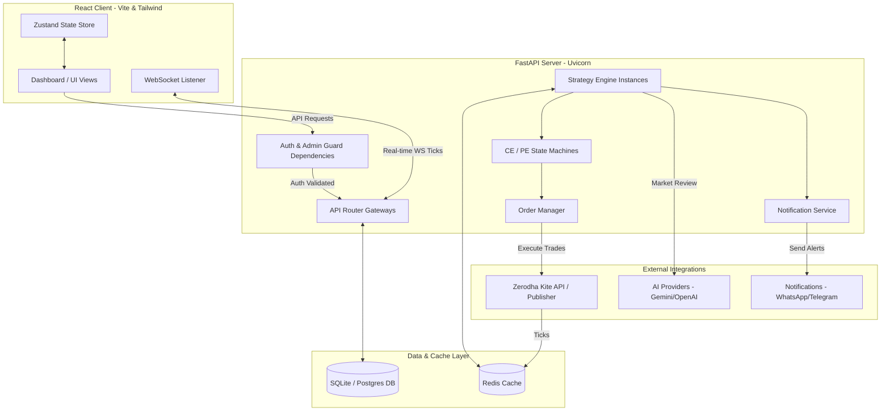
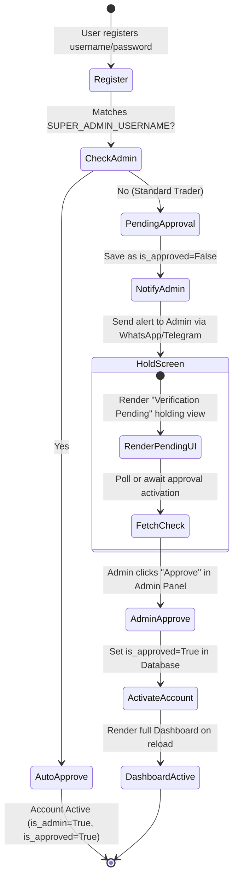
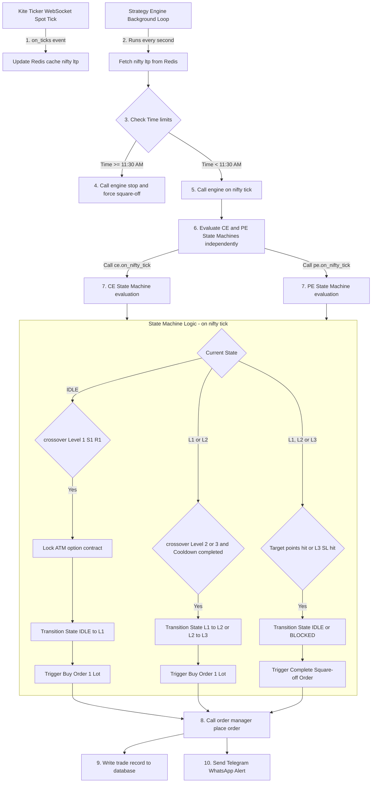

# Pyramid Strategy — High-Level System Architecture Flow 📐

This document provides a comprehensive blueprint of the Pyramid Strategy automated options trading system. It is designed to serve as a reference for understanding the overall component layout, data routing, state machine logic, and user authentication lifecycle.

---

## 1. High-Level Component Architecture

The system is split into a **React Frontend**, a **FastAPI Backend**, a **Redis cache feed**, and various **third-party execution/alert channels**:

---

## 2. Real-Time Tick & Order Processing Flow

The core strategy engine operates on NIFTY spot tick updates. Below is the sequence detailing how ticks trigger crossover detections, strike locks, state updates, and order placements:

```mermaid
sequenceDiagram
    autonumber
    participant Feed as Zerodha Kite Ticker
    participant Redis as Redis Cache
    participant Engine as Strategy Engine (background thread)
    participant SM as CE/PE State Machines
    participant OM as Order Manager
    participant DB as SQLite/Postgres DB
    participant Alert as Telegram/WhatsApp

    Feed->>Redis: 1. Publish NIFTY Spot Price (tick)
    Engine->>Redis: 2. Pull NIFTY price (every second)
    Engine->>Engine: 3. Verify entry cutoff limit (before 11:15 AM IST)
    
    rect rgb(20, 24, 40)
        note right of Engine: If crossover detected on S1/S2/S3 or R1/R2/R3 levels
        Engine->>SM: 4. Process Tick crossover
        SM->>SM: 5. Lock contract strike price (ATM - 50 CE or ATM + 50 PE)
        SM->>OM: 6. Build Order (L1: 1 lot, L2: 2 lots total, L3: 3 lots total)
        OM->>Feed: 7. Submit order request to Kite API
        Feed-->>OM: 8. Order success callback / Avg price returned
        OM->>DB: 9. Write Trade Record & Audit Log
        Engine->>Alert: 10. Send Entry alert message
    end

    rect rgb(30, 20, 20)
        note right of Engine: Exit Monitoring (SL / Target / 11:30 AM Squareoff)
        Engine->>SM: 11. Monitor exit conditions (Target points or Level 3 SL)
        SM->>OM: 12. Trigger complete position exit
        OM->>Feed: 13. Submit exit orders
        OM->>DB: 14. Update exit prices & calculate P&L
        Engine->>Alert: 15. Send Exit details & PDF reports
    end
```

---

## 3. Component Details & Design Specifications

### A. Frontend Client (Vite React + Tailwind CSS)
* **Design Aesthetic**: Midnight dark background (`bg-navy-950`), custom amethyst highlights, glassmorphism containers (`backdrop-blur-xl`), and animated layout updates.
* **Navigation**: Collapsible sidebar navigation. Dynamically renders a `👑 Admin` badge and reveals the **Admin Panel** link only if `user.is_admin === true`.
* **State Management**: Zustand-powered strategy store synchronizes the real-time WebSocket state, ticking option LTPs, live levels, and AI suggestions.

### B. FastAPI Backend Server
* **Authentication Guard**: JWT-based session security. The `require_auth` dependency blocks requests with a `403 Forbidden` status if the user account has `is_approved = False`.
* **Database Models (SQLAlchemy)**:
  * `User`: Credentials, approval status, and admin role flags.
  * `StrategyConfig`: Target/SL parameters, lot sizing configs, and custom S/R points.
  * `Trade`: Record of exact entry and exit times, transaction prices, and net P&L.
* **Auto-Bootstrap System**: If the user registers matching the `SUPER_ADMIN_USERNAME` configured in `.env`, the server automatically marks the user as approved and flags them as an admin on database creation.

### C. Multi-User Strategy Engine
* **Isolation**: Instantiated uniquely per active user. Evaluates state machines (`StateMachine`) independently for CE and PE legs.
* **State Lifecycles**:
  * `IDLE`: Awaiting S/R crossover.
  * `L1`: Locked strike contract, entered 1 lot.
  * `L2`: Averaged down, added 1 lot (total 2 lots).
  * `L3`: Maximum position depth reached, added 1 lot (total 3 lots). Stop Loss activated (10 points below avg price).
* **Safety Guards**: Prevents re-entries on the same leg if a target exit has occurred during the session. Triggers forced squareoff at exactly 11:30 AM.

---

## 4. Moderated Registration Lifecycle Flow

The user approval and activation sequence details how signups are moderated by administrators:

---

## 5. Code Execution Flow Diagram

This diagram charts the logical execution flow of the backend python code when handling market data ticks:

